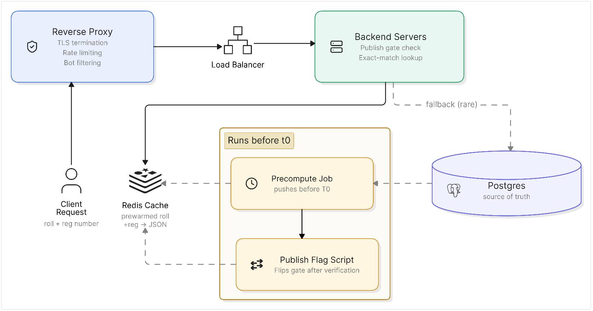

# SSC Result Lookup

A high-throughput exam result lookup API simulating Bangladesh's SSC result publishing infrastructure — designed to serve roughly 2 million student results at a single fixed moment, under three hard constraints: responses must stay under 2 seconds even at peak load, the system must know instantly whether results are live yet, and it must never return a wrong or someone else's result.

This is a backend engineering learning project. The focus is on the architectural decisions that make "serve fixed data fast to millions of concurrent users" a tractable problem — not on the novelty of the domain.

**Single instance benchmark:** Peak 31,910 RPS at , zero errors across 615,000 total requests (CPU-bound at 4 cores). Horizontal scaling to 2 instances behind a load balancer targets the full 40,000+ RPS peak load profile.

---

## The Problem

Bangladesh's education board result days have a historically consistent failure mode: official sites crash under load because everyone — students, parents, siblings, teachers — checks results simultaneously the moment they're announced. The realistic peak isn't a fraction of examinees trickling in. It's most of the 2 million-plus examinees plus their families, all landing within a 2-5 minute window. That works out to roughly **17,000-42,000 requests per second** at the worst moment.

The core insight driving the architecture: **results are immutable once published**. Nothing changes after the fact. This is a "serve fixed data fast" problem, not a live database problem. That changes everything about how I design it.

---

## Architecture



### Full production architecture (diagram above)

The full intended system has four layers:

**1. Reverse proxy (Cloudflare)** — TLS termination, rate limiting, and bot filtering happen at the edge before any traffic reaches real infrastructure. Rate limiting and bot filtering are intentionally delegated to Cloudflare rather than implemented in-app — Cloudflare handles this better than anything I'd build myself, and it's the realistic choice for a system at this scale.

**2. Load balancer** — distributes traffic across a fleet of stateless Go backend instances. Because all state lives in Redis, instances are interchangeable and can be added or removed without coordination.

**3. Go backend servers** — deliberately thin. Each request does exactly two things: check one boolean publish gate, then do one exact-match Redis lookup. No joins, no aggregations, no business logic on the hot path.

**4. Redis (prewarmed)** — the actual serving layer. Every student's result is pre-serialized to JSON and stored at `result:{roll}:{reg}:{year}` before T0. The handler gets a string from Redis and writes it directly to the HTTP response — zero JSON marshaling on the hot path.

**Offline pipeline (runs before T0):**
- Precompute job reads all results from Postgres in 50,000-row cursor-based batches and writes each as a pre-serialized JSON string to Redis
- Verification step counts records in both Postgres and Redis via `SCAN` with a year-scoped pattern, asserts they match
- Publish flag script flips `result:published` from `0` to `1` only after verification passes

**Postgres** sits entirely off the live path — it's the source of truth, used by the precompute job and as a fallback under Redis failure, but never touched by normal student requests.

### What's built

This repo implements the Go backend servers, the precompute job, and the publish gate logic. Cloudflare, the load balancer, and multi-instance deployment are production concerns documented here but not implemented locally — the single-instance API achieves ~23,500 RPS locally, and the architecture is designed to scale horizontally to hit the 40k+ RPS target.

---

## Architecture Decisions

**Redis as the serving layer, Postgres as source of truth** — Redis handles the live request path; Postgres is completely absent from it under normal conditions. The precompute job bridges them before T0. This decouples peak serving load from database capacity entirely — Postgres's write throughput and connection limits are irrelevant to what students experience on result day.

**Pre-serialized JSON in Redis** — each result is stored as a fully serialized JSON string, not as individual fields or a Redis hash. The handler does a single `GET`, gets a string, writes it to the HTTP response. No marshaling, no field assembly, no transformation on the hot path. The precompute job does all the serialization work once, offline.

**Publish gate in Redis, not Postgres** — students start hitting the system before T0. The gate check needs to be as fast as the result lookup itself — a Redis `GET` on `result:published`. A Postgres query for the gate check would add a database round-trip to every pre-publish request, creating load on Postgres at exactly the moment we want it quiet.

**Gate flip only after verified count match** — the publish flag script checks that the count of results in Postgres for the target year matches the count of Redis keys matching `result:*:*:{year}` (via `SCAN`, not `KEYS` — `KEYS` blocks Redis on a large keyspace) before flipping the gate. A partial seed that passes verification would be catastrophic. This check makes it structurally impossible.

**`SCAN` over `KEYS` for verification** — `KEYS *` blocks the entire Redis server until it finishes scanning — at 2 million keys, that's seconds of downtime. `SCAN` iterates incrementally without blocking. The tradeoff is that `SCAN` may return some keys multiple times (cursor-based iteration isn't guaranteed deduplicated), but at this project's scale the overcounting risk is negligible and accepted.

**Cursor-based batching in the precompute job** — `LIMIT`/`OFFSET` at large offsets forces Postgres to scan and discard all previous rows to find the starting position. At offset 1,950,000, that's nearly a full table scan just to locate batch 40. Cursor-based batching using `WHERE id > @lastID ORDER BY id LIMIT 50000` uses the primary key index to jump directly to the right starting position — each batch query is equally fast regardless of which batch it is.

**Redis `SET` upsert behavior makes the precompute job safely re-runnable** — Redis `SET` overwrites existing keys without error. If the precompute job fails partway through and the admin reruns it, already-written keys get overwritten with identical values. No duplicates, no corruption, no special handling needed. The job is idempotent by default.

**Exact-match on roll + reg + exam_year together, never partial** — the composite unique constraint on `(roll, reg, exam_year)` in Postgres, and the corresponding Redis key structure, guarantee that a lookup always returns exactly one result or nothing. There is no partial match, no fuzzy match, no "closest result" fallback.

**Wrong reg and nonexistent roll return identical responses** — a student who enters the wrong registration number and one who enters a roll number that doesn't exist in the system get the exact same `404` response. There is no way to use the API to determine which roll numbers are valid — the system provides no enumeration surface.

**Postgres fallback with connection limiting** — if Redis fails, the API falls back to Postgres for result lookups rather than returning errors. The fallback Postgres pool is intentionally capped at a small number of connections (`PG_FALLBACK_MAX_CONN`, default 20) — if Redis is down and 40,000 RPS suddenly hits Postgres, a naive transparent fallback would kill the database. Connection limiting means at most 20 concurrent fallback queries reach Postgres; all other requests get a degraded-but-alive response rather than a cascading failure. Circuit breaking (stopping all fallback traffic after repeated Postgres failures) is the production-correct next step — documented here but not implemented.

**Rate limiting and bot filtering delegated to Cloudflare** — not implemented in-app. Cloudflare operates at the edge before traffic reaches our infrastructure, handles DDoS and bot fingerprinting better than anything I'd build myself, and requires no application code changes to configure. A custom in-app rate limiter on a system designed to serve 40k RPS would itself become a bottleneck.

**`exam_year` as `INT` not `DATE`** — results are associated with a calendar year, not a specific date. `INT` (`2024`, `2025`) is simpler to query, simpler to index, and more intuitive for the analytics use case than a `DATE` that requires truncation to year.

**`board_name` as a Postgres enum** — restricts board values to a known set at the database level. The tradeoff (adding a new board requires an `ALTER TYPE` migration) is acceptable since Bangladesh's board structure changes rarely. Using a free-text `VARCHAR` would allow invalid board names to silently enter the system.

**`grade` removed — derived from GPA** — an earlier design included a separate `grade` column alongside `gpa`. Removed because grade is fully derivable from GPA (`A+` = 5.00, `A` = 4.00-4.99, etc.), and storing both creates a consistency risk: a bug in the precompute job could write `gpa: 4.8` with `grade: F`. For a system where "never return a wrong result" is a hard constraint, two fields that could contradict each other is an unacceptable design.

---

## Performance

Single instance, local Docker environment, tested with [`hey`](https://github.com/rakyll/hey). Full results in [`load_test_results.json`](./load_test_results.json).

| Concurrency | Requests | RPS | p50 | p90 | p95 | p99 | Errors |
|---|---|---|---|---|---|---|---|
| 50 | 10,000 | 18,040 | 2.2ms | 3.9ms | 4.7ms | 10.4ms | 0 |
| 100 | 20,000 | 24,128 | 3.3ms | 6.0ms | 7.4ms | 16.4ms | 0 |
| 200 | 50,000 | 28,184 | 6.2ms | 10.4ms | 12.1ms | 18.2ms | 0 |
| 300 | 75,000 | **31,910** | 8.7ms | 13.5ms | 15.4ms | 21.0ms | 0 |
| 500 | 100,000 | 21,274 | 21.7ms | 33.8ms | 38.8ms | 59.9ms | 0 |
| 750 | 150,000 | 18,096 | 37.7ms | 53.8ms | 65.7ms | 102.6ms | 0 |
| 1000 | 200,000 | 19,450 | 49.4ms | 60.7ms | 65.1ms | 80.6ms | 0 |

**Zero errors across all 615,000 total requests.**

Peak single-instance RPS is **31,910 at `-c 300`** — the sweet spot before connection overhead begins outpacing gains. Beyond `-c 300`, the server becomes connection-management bound rather than compute bound, which explains the RPS plateau and rising latency at higher concurrency levels. p99 stays under 105ms even at 1,000 concurrent connections.

The target peak load is 17,000-42,000 RPS. A single instance already covers the lower bound of that range. 2 instances behind a load balancer would comfortably hit the upper bound — the architecture is stateless and horizontally scalable without code changes. CPU saturates at ~400% (4 cores) under load, confirming the bottleneck is compute rather than Redis, network, or the Go HTTP stack. Full multi-instance benchmarks require a proper cloud deployment.

---

## Testing

**Handler tests** (`internal/handlers/`) use `miniredis` — a real in-memory Redis server implementation for Go, not a mock. Tests run against real Redis behavior without needing a live Redis instance or Docker.

`TestMain` starts a `miniredis` server and points the Redis client at it. Each subtest calls `testMR.FlushAll()` for isolation.

Cases covered:
- No search params → 400
- Invalid roll (non-numeric) → 400
- Invalid reg (non-numeric) → 400
- Invalid exam year (non-numeric) → 400
- Invalid exam year (out of range) → 400
- Publish gate missing → 503
- Publish gate = `"0"` → 503
- Publish gate = `"1"`, result missing → 404
- Publish gate = `"1"`, result exists → 200 with response body field verification

Run tests:
```bash
go test -race ./...
```

---

## Known Limitations

- **No live deployment.** Cloudflare, a load balancer, and multi-instance deployment are documented as the production architecture but not implemented locally. Single-instance RPS is benchmarked; multi-instance targets are architectural projections.
- **No circuit breaking on the Postgres fallback.** Connection limiting via `pgxpool.MaxConns` protects Postgres from being overwhelmed under Redis failure, but there's no circuit breaker that stops fallback traffic entirely after repeated Postgres failures. `sony/gobreaker` is the natural next addition.
- **`SCAN` may overcount during verification.** Redis `SCAN` can return keys multiple times across cursor iterations. At 2 million keys with a tight year-scoped pattern, the risk is low but nonzero. A tracking set (`SADD` per seeded key, `SCARD` for count) would give an exact count — tradeoff is doubled Redis write traffic during seeding and a consistency risk if `SET` and `SADD` ever diverge.
- **No per-subject result breakdown.** Results store GPA and pass/fail at the student level. Individual subject grades would require a separate `subjects` table linked by `result_id` — a natural extension not in scope for this project.
- **Precompute job runs manually.** An admin triggers the precompute job and publish gate flip by hand. Automating this with a scheduled job or deployment pipeline hook is straightforward but not implemented.

---

## Project Structure

```
result-lookup/
├── cmd/
│   ├── api/
│   │   └── main.go           # HTTP server — publish gate check + Redis lookup
│   └── precompute/
│       └── main.go           # Offline job — seeds Redis, verifies, flips gate
├── internal/
│   ├── database/              # Postgres connection, fallback query
│   ├── handlers/              # HTTP handlers + tests
│   ├── models/                # Request/response/db row structs
│   ├── precompute/            # Batch seeding + count verification logic
│   ├── redis/                 # Redis client init, Get/Set helpers
│   ├── testutils/             # Test DB setup, schema loading, truncation
│   └── utils/                 # Shared utilities (ToJSON, etc.)
├── migrations/                # Versioned schema (golang-migrate, embedded for tests)
├── assets/
│   └── sys-arch.png           # Architecture diagram
├── Dockerfile.api             # Multi-stage build for API binary
├── Dockerfile.precompute      # Multi-stage build for precompute binary
├── docker-compose.yml
├── Makefile
└── .env.example
```

---

## Setup

### Prerequisites
- Docker & Docker Compose
- Go (for running tests locally)
- `make` (or just run the docker commands from [Makefile](./Makefile))

### Environment Variables

```bash
cp .env.example .env
```

Key variables:
```env
PORT=8080
POSTGRES_USER=admin
POSTGRES_PASSWORD=password
POSTGRES_HOST=postgres
POSTGRES_PORT=5432
POSTGRES_DB=mydb
REDIS_ADDR=redis:6379
REDIS_PASSWORD=password
PG_FALLBACK_MAX_CONN=20
```

### Run

```bash
# start API + Redis + Postgres
make up

# run migrations
make migrate-up

# seed test data
make db-seed

# run precompute job for a given year
make precompute year=2025
```

### Makefile Commands

| Command | Description |
|---|---|
| `make up` | Start API, Redis, Postgres |
| `make down` | Stop all services |
| `make migrate-create name=<name>` | Create a new migration file pair |
| `make migrate-up` | Apply pending migrations |
| `make migrate-down` | Roll back the last migration |
| `make db-seed` | Seed test data into Postgres |
| `make precompute year=<year>` | Run precompute job for a given exam year |
| `make clean` | Stop containers, remove volumes/networks |
| `make clean-hard` | Same as clean, also removes images |

---

## What's Next

- Multi-instance deployment behind a load balancer (Nginx or Cloudflare) to hit the 40,000+ RPS target
- Circuit breaking on the Postgres fallback path (`sony/gobreaker`)
- Per-subject result breakdown (`subjects` table linked by `result_id`)
- Automated precompute scheduling instead of manual admin trigger
- Full multi-instance load test on a cloud deployment with real benchmarks